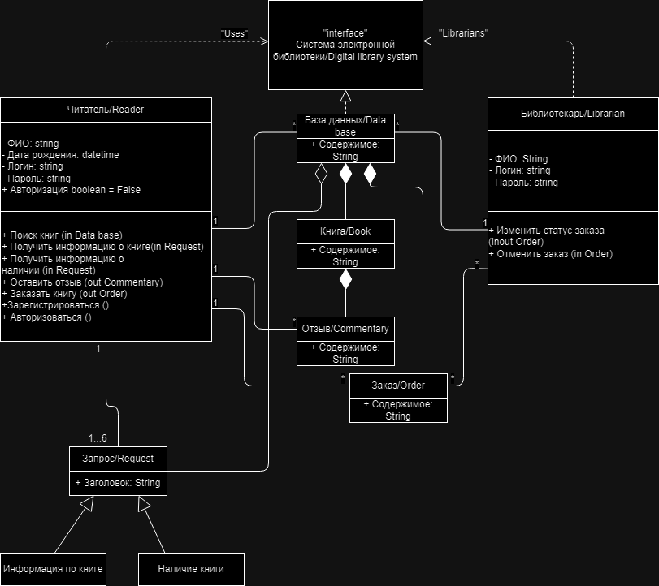
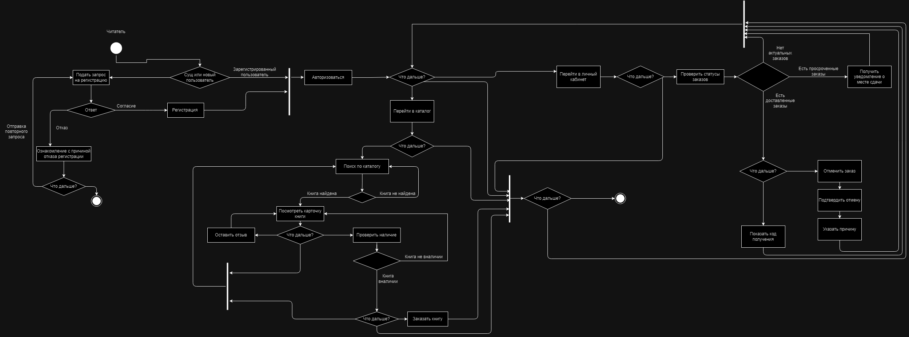
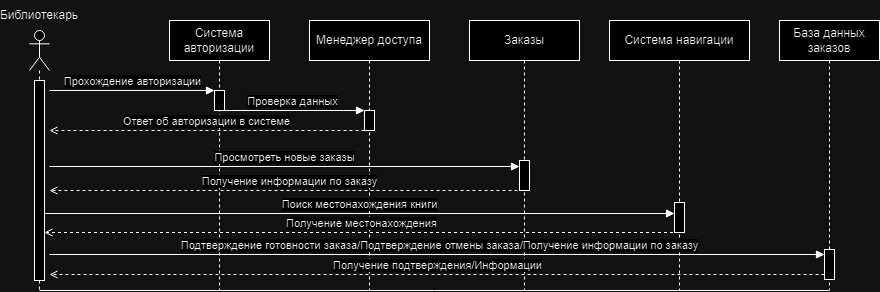
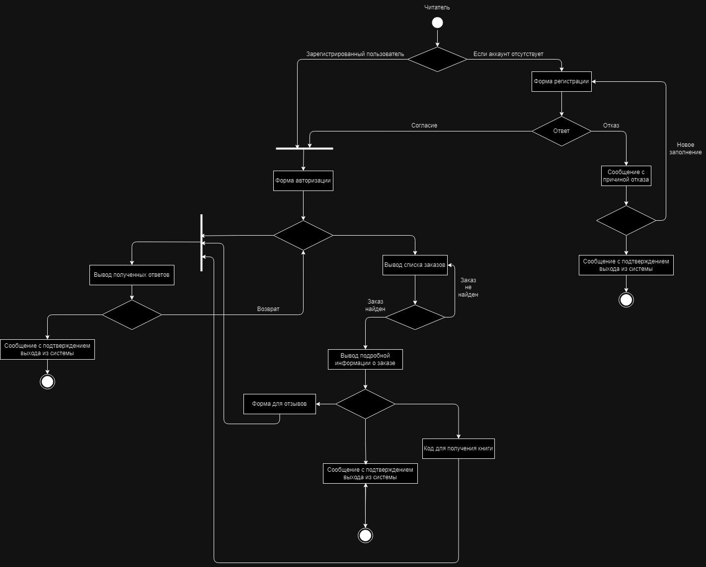
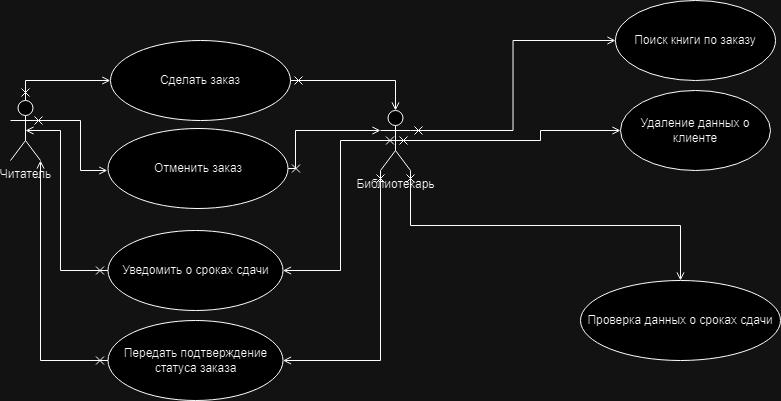

# UML
Laboratory work on UML
### Диаграмма классов

Здесь находится описание первой картинки.

### Диаграмма деятельности

Описание второй картинки.

### Диаграмма последовательности

Описание третьей картинки.

### Диаграмма состояний

Описание четвертой картинки.

### Диаграмма прецедентов

### Позязя

